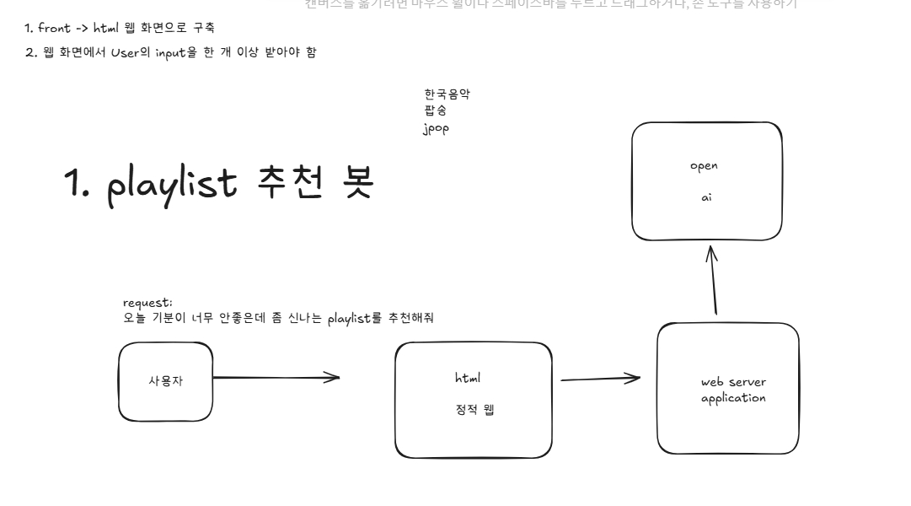
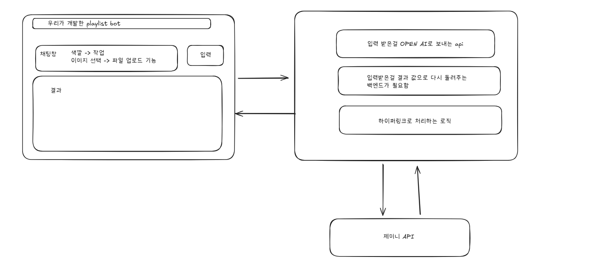

# awschoolteamproject

## 프로젝트 소개
사용자의 현재 기분이나 상황에 맞는 음악 플레이리스트를 추천해주는 웹 기반의 챗봇 서비스입니다. 간단한 대화를 통해 원하는 분위기의 음악을 추천받을 수 있습니다.

## 프로젝트 아키텍처

### 📂 파일 구조

| 경로 | 파일/폴더 | 설명 |
| :--- | :--- | :--- |
| `playlist-bot/` | **`app.py`** | 백엔드의 모든 것! (Flask 서버, API 로직) |
| | **`templates/`** | HTML 템플릿 폴더 |
| | └── `index.html` | 사용자에게 보여줄 유일한 HTML 페이지 |
| | **`static/`** | CSS, JS 등 정적 파일 폴더 |
| | ├── `style.css` | 페이지를 꾸미는 CSS 파일 |
| | └── `script.js` | 프론트엔드 기능(API 요청 등)을 담은 JS 파일 |
| | **`requirements.txt`** | 필요한 라이브러리 목록 |
| | **`.env`** | API 키 등을 저장하는 비밀 파일 |

## 주요 기능
* 자연어 입력을 통한 플레이리스트 추천 요청
* OpenAI 및 Gemini API를 활용한 사용자 맞춤형 음악 추천
* 웹 인터페이스를 통한 챗봇과의 실시간 상호작용

## 역할

명일 : 들러리, ㅄ
소이 : 백엔드 app.py 작성 및 gemini api 연동
창하 : 백엔드 app.py 작성 및 gemini api 연동

## app.py 로직 (팀장 ㅄ이 생각한 방안)

* 설정 부분 (약 10~15줄):

필요한 도구들을 불러오고(import), Flask 앱을 만들고, 우리가 사용할 API 키를 설정하는 부분이에요. 프로젝트를 시작하기 위한 기본 준비운동입니다

* 핵심 로직 함수 (약 40~50줄):

여기가 가장 긴 부분이 될 텐데, 이 부분은 제가(조장) 주로 담당할 거예요.

(1) Gemini API와 대화하는 함수: 사용자가 입력한 텍스트나 이미지를 Gemini에게 보내서 노래 목록을 받아오는 똑똑한 함수.

(2) 음악 정보를 찾아오는 함수: Gemini가 알려준 노래 제목으로 YouTube나 Spotify에서 실제 노래 링크와 앨범 커버를 찾아오는 함수.

* API 경로(라우트) 부분 (약 20~25줄):

이 부분이 바로 팀원분들이 주로 작업하게 될 곳이에요.

프론트엔드(웹사이트)에서 보낸 신호를 받아서, 위에서 만든 핵심 로직 함수를 '호출'만 해주는 아주 간단한 연결 통로 역할이에요. 각자 맡은 기능(텍스트 추천, 이미지 추천)에 따라 1~2줄의 코드만 추가하거나 수정하게 될 겁니다.

* 서버 실행 부분 (딱 2줄):

if __name__ == '__main__': 으로 시작하는, 우리 서버를 '실행'시키는 마지막 코드입니당.